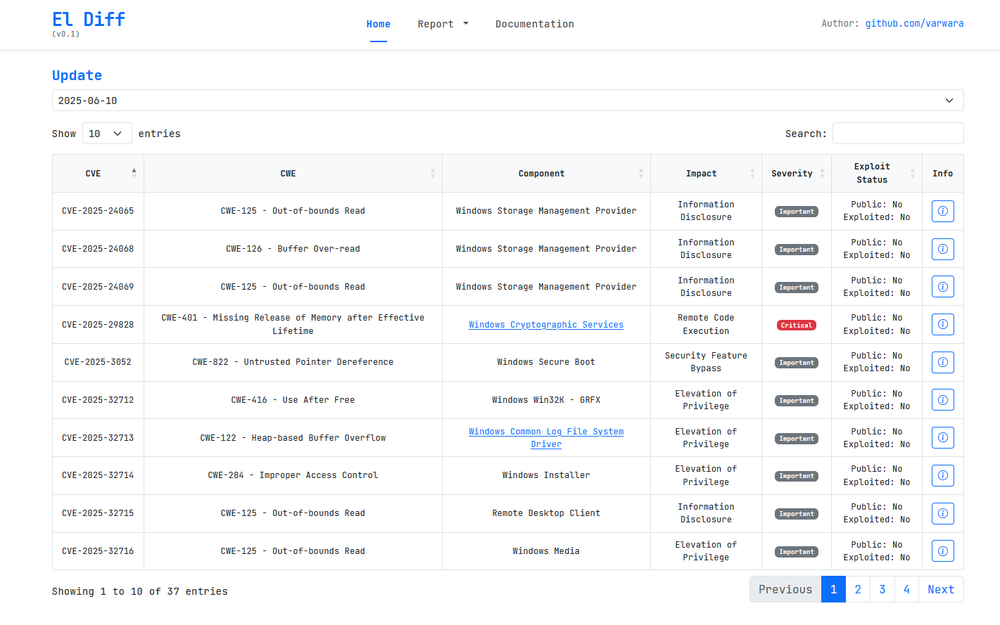
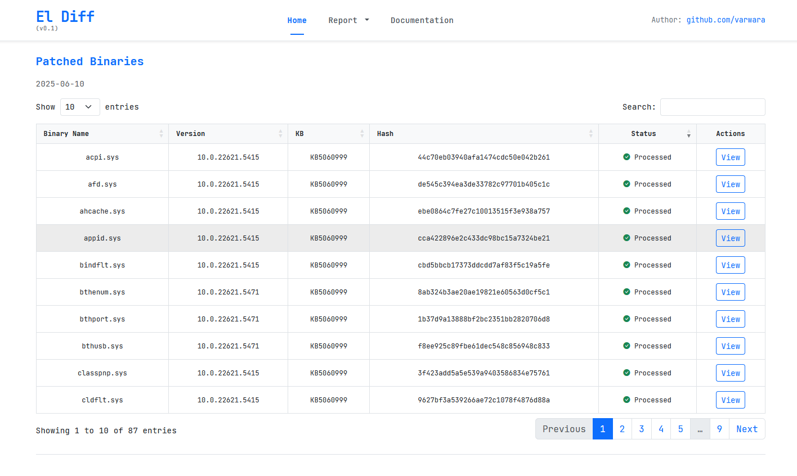
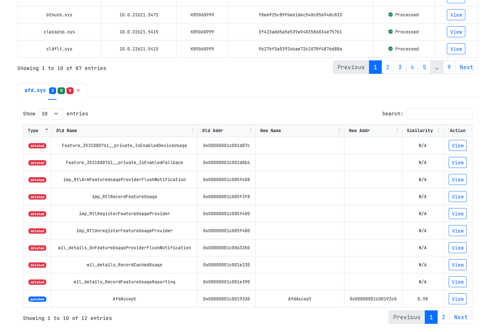
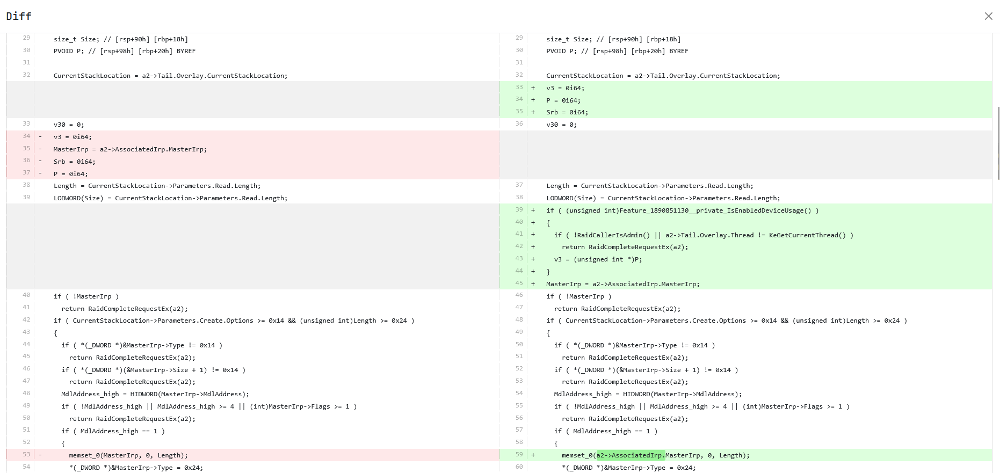
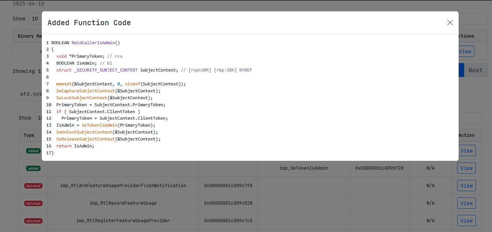
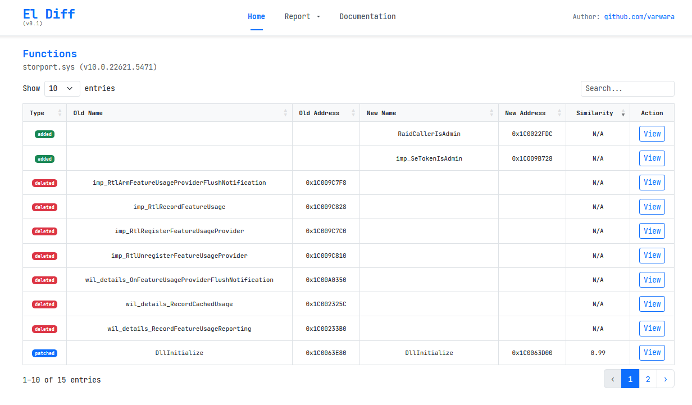
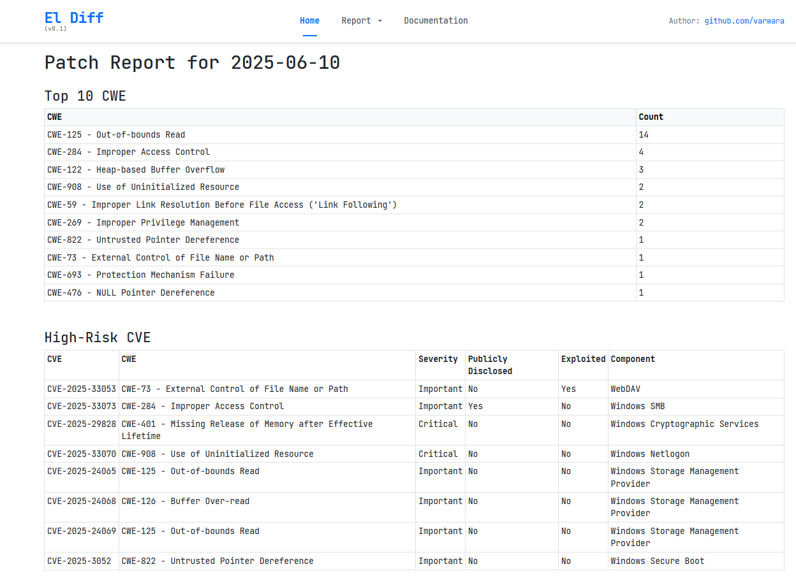

# El Diff — Краткое введение и руководство по использованию

**El Diff** — это простой веб-интерфейс, позволяющий быстро анализировать обновления Patch Tuesday от Microsoft на уровне бинарников и псевдокода функций.
В базе представлены данные для Windows 11 22/23H2. Информация по уязвимостям актуальна за весь период существования данной версии, а информация по бинарникам доступна частично с декабря 2024 по июнь 2025 года.

---

## Возможности

- Просмотр всех CVE из выбранного обновления Microsoft
- Анализ бинарников с отображением изменений функций
- Просмотр добавленных, удалённых и изменённых функций
- Декомпилированные диффы 
- Частичный маппинг для бинарников и уязвимостей

---

## Инструкция по установке

```sh
git clone https://github.com/varwara/eldiff.git
cd eldiff
python3 -m venv venv
source venv/bin/activate

pip install -r requirements.txt

export FLASK_APP=eldiff_minimal.py
flask run --debug
```

## Воркфлоу 

### 1. Таблица CVE

- Показывает CVE из последнего обновления
- Выпадающее меню позволяет выбрать другое обновление (например, `2024-Jun`)
- По кнопке Info открывается окно с деталями для текущей CVE


---

### 2. Отображение KB

- Показывает большинство бинарников, затронутыx в обновлении

Открытие окна с бинарниками осуществляется по двойному клику в таблице CVE.

---

### 3. Отображение изменений

- Таблица всех функций:
  - Изменённые
  - Добавленные/удалённые и импортированные

Чтобы открыть вкладку с функциями нужно нажать на кнопку **View**. Вы можете открывать бесконечное число вкладок для удобства.



---

### 4. Просмотр декомпилированного диффа

- Показывает унифицированный diff для выбранной функции

Чтобы открыть окно с diff нажмите на кнопку **View**.


### 5. Просмотр удаленных и добавленных функций

- Для этих листингов доступна подсветка синтаксиса



### 6. Маппинг

- Реализован частичный маппинг для уязвимостей и бинарников, позволяющий быстрой перейти по ссылке от списка уязвимостей к уязвимому бинарнику и его функциям.



## Простые отчёты

- Отчёт по обновлению включают 4 таблицы со статистикой
    - TOP-10 CWE
    - High-Risk CVE
    - Known Component → Binary → CVE
    - Binary Functions

Может быть расширен/модифицирован. Отчеты доступны по вкладке **Report**.



**Креды guest:xss.is**
