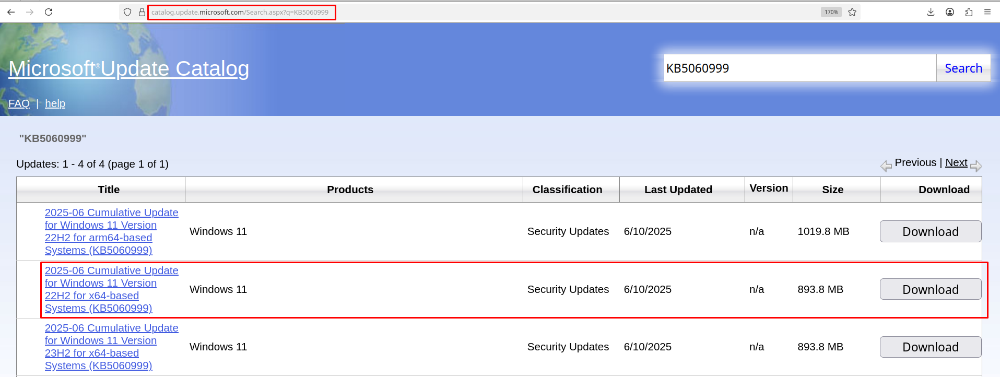
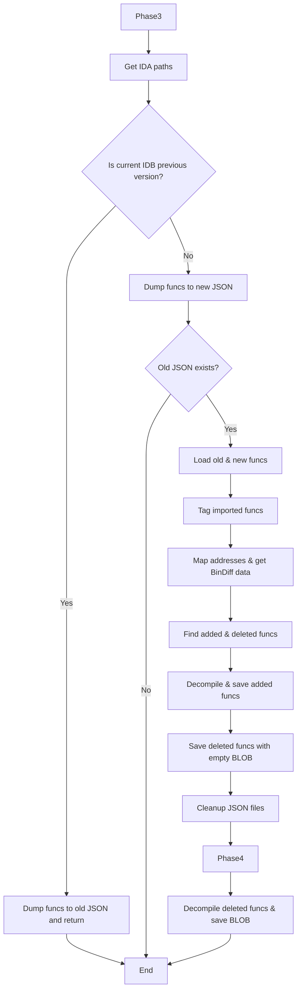

# El Diff


## Table of Contents
- [Introduction](#introduction)
- [Concept](#concept)
- [Implementation](#implementation)
  - [When and how are new updates released?](#when-and-how-are-new-updates-released)
  - [What does the vulnerability bulletin contain?](#what-does-the-vulnerability-bulletin-contain)
  - [Downloading and unpacking updates](#downloading-and-unpacking-updates)
  - [Finding and generating patched files](#finding-and-generating-patched-files)
  - [One Batch, Two Batch, Penny and Dime](#one-batch-two-batch-penny-and-dime)
- [Current Issues](#current-issues)
- [Future Development](#future-development)
- [Acknowledgements](#acknowledgements)

## Introduction

I first learned about programmatically obtaining old and new file versions from Jamie Geiger's article **"Extracting and Diffing Windows Patches in 2020"** back in 2020. It demonstrated how to do this using the **MSDELTA API**. Since then, I haven't seen publicly available tools that automate this entire process. Honestly, I didn't see much point in it myself until late 2024.

In late 2024, I started developing such a tool, inspired by screenshots of TinySec's private **PatchDiff** utility. Since TinySec didn't respond to my questions, I pieced together implementation requirements from fragments of information. Around December, I noticed IBM X-Force was working on a similar application with a BinaryNinja backend, which finally motivated me to push this idea through.

This article outlines my approach to automation and identifies areas for future work. At the end, I'll provide the full prototype source code.

## Concept 

Initially, the idea was to conveniently map binaries for each CVE. From the outset, this seemed like a difficult task, since it is not always clear from the vulnerability description and component name which binary file it refers to. In the long run, however, it didn't seem so daunting, and the task would resolve itself with the emergence of new information in the form of articles analyzing vulnerabilities or explicit indications from the vendor itself as to which binary file is vulnerable. All that is needed in this case is to monitor this information and fill in the gaps. In this way, the tool will be improved and become more informative over time.

I drew the interface with a pen in a notebook in the form of three tables.
The first table is the main page with the contents of all new vulnerabilities for the current Patch Tuesday with a drop-down menu where you can select one of the previous ones.
The second table is a list of patched binary files for the selected Patch Tuesday. The third table is a list of functions for the patched file, including removed, added, and patched functions. And finally, a modal window for displaying the pseudocode of the functions.
With this picture in mind, I started the implementation.

## Implementation

The simplified processing workflow is shown below, with functionality divided into three interfaces:
- `MicrosoftUpdateFetcher` - fetches and downloads updates
- `PatchExtractorManager` - unpacks updates and extracts patched files
- `DiffManager` - generates databases (.i64, .BinExport, .BinDiff), decompiles code, and produces function pseudocode and [unified diffs](https://www.gnu.org/software/diffutils/manual/html_node/Unified-Format.html)

```mermaid
flowchart TD
  A[Start] --> D[Fetch all security updates from MSRC API]
  D --> G[Next update]

  subgraph Loop
    G --> H[Fetch CVRF XML]
    H --> I[Get Vuln Info]
    I --> J[Get KB link]
    J --> K{KB date valid & not exists in DB?}
    K -- No --> Loop_End  
    K -- Yes --> L[Update Vulnerabilities table]

    L --> M{KbDate > CUTOFF_DATE?}
    M -- No --> Loop_End
    M -- Yes --> N[Download KB archive]
    N --> O[Extract KB]
    O --> P[Fetch component mappings]
    P --> Q[Find candidate patched files & fill binaries table with prepatch info]
    Q --> R[Apply delta patches & update binaries table with patched binary paths]
    R --> S[Run IDA batch script over new binaries]
    S --> T[Generate BinExport & BinDiff db's]
    T --> U[Decompile funcs for old and new db's]
    U --> V[Make unified diff for patched funcs]
    V --> Loop_End
  end

  Loop_End --> W{More updates?}
  W -- Yes --> Loop
  W -- No  --> X[End]
  ```
*Fig 1. Simplified application workflow*

## When and how are new updates released?

Microsoft has several update types (detailed [here](https://techcommunity.microsoft.com/blog/windows-it-pro-blog/windows-monthly-updates-explained/3773544)). We focus on **Monthly Security Updates** (Patch Tuesday), released every second Tuesday of the month. Microsoft stores update information in XML format, including release dates and vulnerability bulletin links. Fetch updates using `get_security_updates` API.

**Example**
```py
updates = MicrosoftUpdateFetcher.get_security_updates()
for upd in updates:
    print(upd)
```

**Output**

```json
// Cropped
{'ID': '2016-Apr', 'Alias': '2016-Apr', 'DocumentTitle': 'April 2016 Security Updates', 'Severity': None, 'InitialReleaseDate': '2016-04-12T07:00:00Z', 'CurrentReleaseDate': '2018-04-10T07:00:00Z', 'CvrfUrl': 'https://api.msrc.microsoft.com/cvrf/v3.0/cvrf/2016-Apr'}
{'ID': '2016-Aug', 'Alias': '2016-Aug', 'DocumentTitle': 'August 2016 Security Updates', 'Severity': None, 'InitialReleaseDate': '2016-08-09T07:00:00Z', 'CurrentReleaseDate': '2017-09-12T07:00:00Z', 'CvrfUrl': 'https://api.msrc.microsoft.com/cvrf/v3.0/cvrf/2016-Aug'}
```
We then work with data from `CvrfUrl`.

### What does the vulnerability bulletin contain?

The vulnerability bulletin is a large XML tree containing Microsoft product information. Products are listed under `prod:ProductTree` with numerical IDs. For **Windows 11 23H2**, the ID is `12243`. Extract table data using:

- get_cve_by_product_id
- get_vuln_info
- get_notes_from_vuln_info
- get_threat_info
- get_fixes

**Example**
```py
cvrf_url = upd.get("CvrfUrl")
product_id = MicrosoftUpdateFetcher.PRODUCT_ID_WIN11_23H2_X64
data = MicrosoftUpdateFetcher.fetch_cvrf_xml(cvrf_url)

cves = MicrosoftUpdateFetcher.get_cve_by_product_id(product_id, data)
for cve in cves:
    v = MicrosoftUpdateFetcher.get_vuln_info(cve, data)
    n = MicrosoftUpdateFetcher.get_notes_from_vuln_info(v)
    f = MicrosoftUpdateFetcher.get_fixes(cve, product_id, data)
    th = MicrosoftUpdateFetcher.get_threat_info(cve, product_id, data)
    print(v, n, f, th)
```

### Downloading and unpacking updates

To download and subsequently unpack updates, we need to find the link to the current `.msu` archive. We can do this manually on the [Microsoft Update Catalog](https://catalog.update.microsoft.com/Search.aspx) page. In order to obtain the link programmatically, we had to sniff the requests a little and write our own implementation, since the link is generated dynamically and simple page parsing is not enough. I will not describe the generation mechanism here, but if anyone is interested, you can look at the functions `get_update_id_by_kb` and `get_kb_link`.



Since we can obtain the necessary KB number from the output of the `get_fixes` function, all that remains is to extract the link and download the archive.

**Example**

```py
f = MicrosoftUpdateFetcher.get_fixes(cves[0], product_id, data)
url = f.get("vuln:URL")
kb = MicrosoftUpdateFetcher.extract_kb_from_url(url)
id = MicrosoftUpdateFetcher.get_update_id_by_kb(kb, product_id, data)
print(id)
kb_link = MicrosoftUpdateFetcher.get_kb_link(id)
print(kb_link)
kb_path = MicrosoftUpdateFetcher.download_msu_file(kb_link, upd_dir) # upd_dir is output dir
```

**Output**
```sh
1e061de7-b57f-4b4c-b902-8ab1ef9c6eec # id
https://catalog.sf.dl.delivery.mp.microsoft.com/filestreamingservice/files/f46df37a-242e-454c-8d81-b505c4ec7473/public/windows11.0-kb5044285-x64_0879eebfa8d66123e40f2c2614bcfd16d053abe3.msu # archive link
```

To unpack the updates, I used the [PatchExtract.ps1](https://gist.github.com/hugsy/00509cabd4917c947155ed782fb4cd2b#file-patchextract-ps1), implemented in the `run_patch_extract` wrapper of the `PatchExtractorManager` class. After running the script, the patches are located in the `x64` directory. Each patch is located in the `f` subdirectory of the directory, which includes the component name and version. The example below shows a list of such directories found by the substring `kernel`.

**Example**
```
D:\eldiff\updates\2025-07-08\x64>dir | findstr kernel
07/08/2025  09:31 PM    <DIR>          c..-kerneltracecontrol_10.0.22621.3527
07/08/2025  09:45 PM    <DIR>          d..tshow-kernelsupport_10.0.22621.5413
07/08/2025  09:48 PM    <DIR>          errorreportingkernel_10.0.22621.5415
07/08/2025  09:42 PM    <DIR>          hyperv-vmkernelintvdev_10.0.22621.5262
07/08/2025  09:50 PM    <DIR>          i..displays-kernelmode_10.0.22621.5471
07/08/2025  09:34 PM    <DIR>          kernel-appcore_10.0.22621.3958
07/08/2025  09:48 PM    <DIR>          kernel32_10.0.22621.5415
07/08/2025  09:51 PM    <DIR>          kernelbase_10.0.22621.5547
07/08/2025  10:00 PM    <DIR>          kernelstreamingthunk_10.0.22621.5624
07/08/2025  09:51 PM    <DIR>          kernelstreaming_10.0.22621.5547
07/08/2025  09:50 PM    <DIR>          lsa-minwin-kernel_10.0.22621.5471
07/08/2025  10:00 PM    <DIR>          microsoft-onecore-i..atedusermode-kernel_10.0.22621.5624
07/08/2025  09:42 PM    <DIR>          microsoft-onecore-i..sermode-kernel-la57_10.0.22621.5262
07/08/2025  10:01 PM    <DIR>          os-kernel-la57_10.0.22621.5624
07/08/2025  10:01 PM    <DIR>          os-kernel_10.0.22621.5624
07/08/2025  09:49 PM    <DIR>          rpc-kernel_10.0.22621.5415
07/08/2025  09:50 PM    <DIR>          wdf-kernellibrary_10.0.22621.5415
```

And the forward delta file for `ntoskrnl.exe` itself.

**Output**
```
D:\eldiff\updates\2025-07-08\x64\OS-KERNEL_10.0.22621.5624
└───f
        ntoskrnl.exe
```

### Searching for and generating patched files

This is where things get interesting. We need to identify the patched files. And here there are several issues related to file versions and the OS.

The file version often does not match the OS version. This rules out simple filtering by system version, forcing us to use thresholds based on previous updates. Here's how it looks using the April update as an example.

| CVE             | Binary        | Version         |
|-----------------|---------------|-----------------|
| CVE-2025-27473  | http.sys      | 10.0.22621.5185 |
| CVE-2025-29824  | clfs.sys      | 10.0.22621.5189 |
| CVE-2025-27471  | mskssrv.sys   | 10.0.22621.5124 |

Another problem that does not concern versioning as such is that the updates also include patches that are not related to fixing vulnerabilities. Such patches are in the overwhelming majority, and their versions overlap with the versions of vulnerable files. This means that we cannot filter them out at the initial sorting stage without complete mapping. However, there is a problem even in this case. Mapping will allow us to obtain the binaries described in the bulletin with 100% certainty, but it will not allow us to capture binaries with potential “silent fixes.”
 
Below are the statistics on updates. 

| Date        | Total | Sys | Exe | Dll  | Efi | Candidates |
|-------------|-------|-----|-----|------|-----|------------|
| 2025-06-10  | 2415  | 193 | 358 | 1863 | 1   | 89         |
| 2025-05-13  | 2511  | 193 | 368 | 1942 | 8   | 89         |
| 2025-04-08  | 2333  | 115 | 364 | 1846 | 8   | 98         |
| 2025-03-11  | 1028  | 60  | 186 | 774  | 8   | 51         |
| 2025-02-11  | 1987  | 52  | 330 | 1597 | 8   | 52         |
| 2025-01-14  | 224   | 19  | 33  | 164  | 8   | 26         |
| 2024-12-10  | 4101  | 307 | 632 | 3153 | 9   | 94         |

**TOTALS:** 7 updates with **14599 files** (**499 candidates**)

Here, in the data for December 2024, we have the total number of files in the update. This is the basis, since we have nothing to compare it with yet (except perhaps the OS version for this update). Or, as in my case, with the **Candidates** list, which we will discuss later. After December, we already have a baseline from which we can start comparing file versions and get a list of actually patched files. But even in this case, there are thousands of files after January. Processing such a large amount of data manually is unrealistic for me personally, so it was decided to create a list of Candidates.

Candidates is a list of binary files that have been vulnerable for the past six months, as well as components that I find interesting and patches that I would not want to miss. These are mainly drivers, which is due to trends in Windows OS usage in recent years. We use this list for comparison when we find a patched version. The list can be easily scaled depending on the objectives.

```
POPULAR_BINARIES = ['acpi.sys', 'afd.sys', 'ahcache.sys', 'appid.sys',
                    'applockerfltr.sys', 'bindflt.sys', 'bthenum.sys',
                    'bthmini.sys', 'bthport.sys', 'bthusb.sys', 'classpnp.sys',
                    'cldflt.sys', 'clfs.sys', 'clipsp.sys', 'cng.sys',
                    'crashdmp.sys', 'dam.sys', 'dumpfve.sys', 'dxgkrnl.sys',
                    'dxgmms1.sys', 'dxgmms2.sys', 'exfat.sys', 'fastfat.sys',
                    'fltmgr.sys', 'fvevol.sys', 'fwpkclnt.sys', 'hdaudio.sys',
                    'http.sys', 'hvsifltr.sys','ks.sys', 'ksecdd.sys',
                    'ksecpkg.sys', 'ksthunk.sys', 'luafv.sys', 'mbbcx.sys',
                    'monitor.sys', 'mqac.sys', 'mrxsmb.sys', 'msgpioclx.sys',
                    'mskssrv.sys', 'msquic.sys', 'mssecflt.sys', 'ndis.sys',
                    'netio.sys', 'netvsc.sys', 'ntfs.sys', 'p9rdr.sys',
                    'pci.sys', 'prjflt.sys', 'processr.sys',
                    'rdpvideominiport.sys', 'refs.sys', 'refsv1.sys',
                    'rmcast.sys', 'srv.sys', 'srv2.sys', 'srvnet.sys',
                    'storport.sys', 'tbs.sys', 'tcpip.sys', 'tcpipreg.sys',
                    'tpm.sys', 'usbccgp.sys', 'usbhub3.sys', 'usbprint.sys',
                    'usbvideo.sys', 'usbxhci.sys', 'vhdmp.sys',
                    'vkrnlintvsp.sys', 'vmsproxy.sys', 'vmsproxyhnic.sys',
                    'vmswitch.sys', 'win32k.sys', 'win32kbase.sys',
                    'win32kfull.sys', 'winnat.sys', 'winsetupmon.sys',
                    'wmiacpi.sys', 'wtd.sys', 'xboxgip.sys', 'hvax64.exe',
                    'hvix64.exe', 'hvloader.dll', 'kdhvcom.dll', 'winload.exe',
                    'bootmgfw.efi', 'cryptsvc.dll', 'ole32.dll']
```

The entire sorting process can be described by the code below.

```py
# 1. Obtaining tags from the current update and the component_mapping table
tags      = PatchExtractorManager.fetch_tags(db_path, kb_date)
comp_map  = PatchExtractorManager.fetch_component_mapping(db_path)
candidates = PatchExtractorManager.get_candidate_binaries(tags, comp_map, POPULAR_BINARIES)

# 2. Determining the threshold value 
threshold = PatchExtractorManager.fetch_global_threshold(db_path, kb_date)

# 3. Define the final list of binary files 
scanned    = PatchExtractorManager.find_new_patched_files(x64_bin_path, threshold)
to_process = [f for f in scanned if f[„name“] in candidates]
```

First, component “tags” are extracted from the vulnerability table and matched with actual file names, after which a predefined list of popular system modules is added to them. Then, based on the previous update, the maximum threshold version is calculated, and only those files whose version number exceeds this threshold are selected. As a result, only the relevant patches for the necessary components are included in the final list, which significantly saves time and resources when generating IDA/BinExport/BinDiff databases and pseudocode.

Next, the base file is searched for and the `binaires` table is initialized in the `populate_binaries_table` function. There are also some nuances here. In short, we need the base file when generating the patch. I don't know how it works, but sometimes the patch is generated with an error, even though the same conditions are met - the version `base_file <= forward_delta_file` (or more precisely, Update Build Revision).

```py
 base_path = PatchExtractorManager.find_base_binary2(binary_name, binary_version, r"C:\Windows\WinSxS") or PatchExtractorManager.find_base_binary2(binary_name, binary_version, r"C:\Windows\system32")
```

The base file is searched for in two directories as a precaution, because in practice, sometimes the necessary files are missing from `WinSxS`. For example, if the system has not been updated for a long time.  At the same time, if we apply a patch with the base file from `System32`, we may encounter errors again for unclear reasons. In addition to the base file, we also need a `reverse delta` file to generate the patch.
These files are stored in the WinSxS directory. You can see that its contents are similar to what we saw after unpacking the archive.

**Example**
```
C:\Windows\WinSxS>dir | findstr kernel
05/19/2025  02:36 PM    <DIR>          amd64_microsoft-windows-kernelstreamingthunk_31bf3856ad364e35_10.0.22621.5262_none_127a5f029308481e
06/23/2025  02:20 PM    <DIR>          amd64_microsoft-windows-kernelstreamingthunk_31bf3856ad364e35_10.0.22621.5415_none_125f7960931d4e30
05/19/2025  02:36 PM    <DIR>          amd64_microsoft-windows-kernelstreaming_31bf3856ad364e35_10.0.22621.5331_none_3774403f11702ec1
06/23/2025  02:20 PM    <DIR>          amd64_microsoft-windows-kernelstreaming_31bf3856ad364e35_10.0.22621.5471_none_376d717b1174b00e
05/19/2025  02:36 PM    <DIR>          amd64_microsoft-windows-lsa-minwin-kernel_31bf3856ad364e35_10.0.22621.5262_none_bd7810dde432bb50
06/23/2025  02:20 PM    <DIR>          amd64_microsoft-windows-lsa-minwin-kernel_31bf3856ad364e35_10.0.22621.5471_none_bd638817e441f2e8
10/20/2024  11:50 AM    <DIR>          amd64_microsoft-windows-m..manifests-minkernel_31bf3856ad364e35_10.0.22621.1_none_ba204c9b0e676818
10/20/2024  11:50 AM    <DIR>          amd64_microsoft-windows-m..manifests-minkernel_31bf3856ad364e35_10.0.22621.1_none_d74ae4aa81707280
05/19/2025  02:36 PM    <DIR>          amd64_microsoft-windows-os-kernel_31bf3856ad364e35_10.0.22621.5331_none_4c23df882faf25dc
06/23/2025  02:20 PM    <DIR>          amd64_microsoft-windows-os-kernel_31bf3856ad364e35_10.0.22621.5471_none_4c1d10c42fb3a729
``` 

**Output**
```
C:\WINDOWS\WINSXS\AMD64_MICROSOFT-WINDOWS-OS-KERNEL_31BF3856AD364E35_10.0.22621.5471_NONE_4C1D10C42FB3A729
|   ntoskrnl.exe
|
+---f
|       ntoskrnl.exe
|
\---r
        ntoskrnl.exe
```

*Note: According to my observations, WinSxS may contain delta files for the last two or three versions. In practice, however, the application sometimes logged errors during the search. Upon manual analysis, it became clear that the delta files themselves were missing despite the presence of subdirectories*.

Here we see a new subdirectory `r`, which stores the required delta file.  Now we have everything we need to generate a patch for the new file.  The patch is generated in the `apply_patch` function, which is a wrapper for the [delta_patch.py](https://gist.github.com/wumb0/9542469e3915953f7ae02d63998d2553) utility. Here, we should give credit to Microsoft for the API documentation for working with patches.

```py
  @staticmethod
  def apply_patch(base_path, forward_delta_path, reverse_delta_path, output_path, patch_script_path):
      """
      Applies forward and reverse deltas to create the patched binary.
      """
      try:
          cmd = [
              r"C:\Python312\python.exe", patch_script_path,
              "-i", base_path,
              "-o", output_path,
              reverse_delta_path,
              forward_delta_path
          ]
          subprocess.run(cmd, check=True)
          logger.info(f"Successfully created patched binary at: {output_path}")
          return True
      except subprocess.CalledProcessError as e:
          logger.exception(f"Failed to apply patch for {base_path}: {e}")
          return False
```

All paths, file names, and their versions are saved in the database for future use.

### One batch, Two batch, Penny and Dime

Now that you have all the binary files, you need to create three databases for each one.
- A database for IDA (required to create a .BinExport database and decompile functions)
- A .BinExport database (required to create a .BinDiff database)
- A .BinDiff database (required to obtain patched, removed, and added functions)

To quickly generate IDA databases, we can use [batch mode](https://hex-rays.com/blog/igor-tip-of-the-week-08-batch-mode-under-the-hood) without launching the graphical interface. This functionality is implemented in the `run_ida_batch` wrapper. **BinExport** is part of the BinDiff utility that exports data from IDA to [protobuf](https://protobuf.dev/), and the .BinDiff database is nothing more than an SQLite database that contains almost all information about the differences between two files. First of all, we are interested in which functions have been patched.

**Example**
```py
for binary_name, binary_version, binary_path in binaries:
    DiffManager.run_ida_batch(binary_path, db_path)

DiffManager.generate_binexport_for_kbdate(upd_dir, formatted_kb_date)
DiffManager.generate_bindiff(formatted_kb_date, db_path, upd_dir)
```

Once again, all paths are saved to the `updates.db` database. Now we are faced with the final task: searching for corrected, new, and deleted functions, obtaining a unified diff, and decompiling. The entire process is divided into four phases.

**Example**
```py
for binary_name, binary_version, binary_path in binaries:
    """
    Phase 1: Preload patched functions rows
    Phase 2: Decompile, compress, update patched
    functions table
    Phase 3: Preload, decompile, compress added
    functions, update added/deleted functions table,
    preload deleted function with empty BLOB
    """
    DiffManager.analyze_funcs(db_path,
                              MicrosoftUpdateFetcher.IDA_EXE_PATH,
                              MicrosoftUpdateFetcher.PHASE123_SCRIPT_PATH,
                              binary_name,
                              binary_version)

    DiffManager.make_diff(db_path, binary_name, binary_version)


    # Phase 4: Decompile, compress, update BLOB for
    # deleted functions
    DiffManager.process_added_deleted_functions(db_path,
                                                MicrosoftUpdateFetcher.IDA_EXE_PATH,
                                                MicrosoftUpdateFetcher.PHASE4_SCRIPT_PATH,
                                                binary_name,
                                                binary_version)
```

At this stage, all logic is transferred to two scripts - `decompile_func.py` and `decompile_added_deleted.py`, which are run sequentially for each binary.
Since decompiling all files in their entirety is quite time-consuming, I decided to decompile only the necessary functions and save them in compressed form in the database. Obtaining patched functions is fairly trivial and is described by the `get_patched_functions` function.

```py
def get_patched_functions(bd_path):
    if not os.path.exists(bd_path):
        log_message(f"[ERROR] BinDiff DB not found: {bd_path}")
        return []

    with sqlite3.connect(bd_path) as conn:
        cur = conn.cursor()
        cur.execute("""
            SELECT name1, name2, address1, address2, similarity
              FROM function
             WHERE similarity < 1
        """)
        results = cur.fetchall()
    log_message(f"[INFO] Patched functions ({len(results)}): {results}")
    return results
```

Next, we need to run the old and new IDA databases with the `decompile_func.py` script, passing the name and version of the new file as parameters. Under the hood, the script finds the path for the previous version of IDA and, depending on which database is running, decompiles the function at the corresponding address, compresses it, and saves the BLOB to the database.

**Example**
```py
patched = get_patched_functions(bd_path)

# phase 1: preload rows
for n1, n2, a1, a2, sim in patched:
  DiffAnalysis.pre_init_func_table(bin_name, bin_ver, n1, n2, a1, a2, sim)

# phase 2: decompile & compress each
ida_paths = DiffManager.get_ida_paths(ABS_DB_PATH, bin_name, bin_ver)
cur_idb, prev_idb = [os.path.join(EL_DIFF_APP, p) for p in ida_paths]

for n1, n2, a1, a2, sim in patched:
  # Choose correct address to decompile depending on old or new i64
  if idc.get_idb_path() == prev_idb:
      addr, col = (int(a1,16) if isinstance(a1,str) else a1), "old_code"
  else:
      addr, col = (int(a2,16) if isinstance(a2,str) else a2), "new_code"

  code = decompile_function(addr)

  gz = gzip.compress(code.encode())
  DiffAnalysis.add_func_blobs(bin_name, bin_ver, n1, gz, col)
```

To complete the picture, we need the removed and added functions. Unfortunately, this information is not available in the .BinDiff database, so we have to do it some other way.  I solved this problem by obtaining all addresses from the two IDA databases and comparing these two lists with the addresses from the `functions` table of the .BinDiff database. All different addresses will be added/removed. But what about imported functions? To get a list of added/removed imported functions, we need to extend the algorithm with a simple `get_imported_functions` function.

```py
def get_imported_functions():
  """
  Enumerate all imported functions in the current IDB.
  """
  imports = []
  count = ida_nalt.get_import_module_qty()
  for midx in range(count):
      def _cb(ea, name, ordinal):
          fname = name or f"ordinal_{ordinal}"
          imports.append((fname, ea))
          return True
      ida_nalt.enum_import_names(midx, _cb)
  return imports
```

In the web interface, these functions have the prefix `imp_` and do not have code. Where might this be useful? For example, the presence of functions such as `imp_ProbeForRead` and `imp_ProbeForWrite` in the diff should attract attention for checking for vulnerabilities related to the processing of untrusted pointers.

The decompilation process is extended by the `decompile_added_deleted.py` script. Despite the name, only deleted functions are decompiled, while added functions are decompiled earlier in the third phase. In reality, it turned out to be a little more complicated because of how we extract all these functions. Most of the process is described by the functions `phase3_process` and `update_deleted_blob`. Schematically, we can represent this process as follows. Remember that this algorithm is applied twice — first to the old version of `.idb`, and then to the new one.


*Fig. 2. Simplified diagram of adding/removing functions*

## Current issues
- Bug when processing files without symbols, for example, `hvix64.exe`. Added and deleted functions are identified incorrectly. 
- No exception handling during decompilation, so there are losses. The list of such functions can be checked via an SQL query to the database.
    ```sql
    SELECT COUNT(*) FROM functions
    WHERE (old_code IS NULL)
    OR (new_code IS NULL);
    ```
- Depending on the installed version of Python for IDAPython, the scripts `decompile_func.py` and `decompile_added_deleted.py` may crash. It is recommended to use Python 3.9.0 for IDAPython and Python 3.12 for El Diff.
- Sometimes `apply_delta.py` crashes when creating a patched file. The reason is not yet clear.
- Identification of all potentially vulnerable files during mapping. One component may belong to several binary files, and one binary file may belong to several components.
For example, the `Windows Kernel` and `Windows Event Tracing` components belong to `ntoskrnl.exe`, while `hvix64.exe`, `hvax64.exe`, `hvloader.dll`, and `kdhvcom.dll` belong to the `Windows Hyper-V` component.

## Further development
- Opening IDA for the selected file (for the self-hosted version)
- Links for downloading IDA, BinDiff, and BinExport databases
- Global search across all updates (functions, vulnerability information)
- Disassembler output and graph view
- Pseudo-code normalization for drivers
- Support for other ProductIDs (Windows 24H2, etc.)
- Improved mapping
- Async

## Acknowledgements

- Jamie Geiger, Greg Linares, TinySec for inspiration
- Hex-Rays & BinDiff developers

# Links
1. https://www.trellix.com/assets/docs/atr-library/tr-hyper-v-automation-for-windows-patch-diffing.pdf
2. https://wumb0.in/extracting-and-diffing-ms-patches-in-2020.html
3. https://gist.github.com/wumb0/9542469e3915953f7ae02d63998d2553
4. https://gist.github.com/wumb0/306f97dc8376c6f53b9f9865f60b4fb5